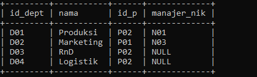

 # Tugas Praktikum 6 (Pertemuan ke 14) 


|Nama|NIM|Kelas|Mata Kuliah|
|----|---|-----|------|
|**Radityatama Nugraha**|**312310644**|**TI.23.A6**|**Basis Data**|

# Soal :

## 1. Sebuah perusahaan ingin membuat sistem untuk pengelolaan data karyawan pada perusahaan tersebut dengan ketentuan:
### a) Perusahaan tersebut terdiri dari beberapa departemen yang dipimpin oleh seorang manager (manajer merupakan bagian dari karyawan).
### b) Karyawan bekerja pada salah satu departemen.
### c) Karyawan memiliki atasan langsung seorang supervisor.
### d) Seorang supervisor dapat membawahi beberapa karyawan.
### e) Setiap karyawan dari lintas departemen dapat bekerja pada satu project yang sama dalam satu waktu.
### f) Setiap karyawan dapat mengerjakan beberapa project yang berbeda. 
## 2. Buatlah desain databasenya (ER-Diagram), beserta tabel datanya?

# Desain ER-Diagramnya :


# SQL JOIN
### Studi Kasus ERD Karyawan

# Input Data
```sql
CREATE TABLE Perusahaan(
id_p VARCHAR(10) PRIMARY KEY,
nama VARCHAR(45) NOT NULL,
alamat VARCHAR(45) DEFAULT NULL
);

INSERT INTO Perusahaan VALUES
('P01', 'Kantor Pusat', NULL),
('P02', 'Cabang Bekasi', NULL);

SELECT * FROM Perusahaan;
```
## Output nya :


```sql
CREATE TABLE Departemen(
id_dept VARCHAR(10) PRIMARY KEY,
nama VARCHAR(45) NOT NULL,
id_p VARCHAR(10) NOT NULL,
manajer_nik VARCHAR(10) DEFAULT NULL
);

INSERT INTO Departemen VALUES
('D01', 'Produksi', 'P02', 'N01'),
('D02', 'Marketing', 'P01', 'N03'),
('D03', 'RnD', 'P02', NULL),
('D04', 'Logistik', 'P02', NULL);

SELECT * FROM Departemen;
```
## Output nya :


```sql
CREATE TABLE Project(
id_proj VARCHAR(10) PRIMARY KEY,
nama VARCHAR(45) NOT NULL,
tgl_mulai DATETIME,
tgl_selesai DATETIME,
status TINYINT(1)
);

INSERT INTO Project VALUES
('PJ01', 'A', '2019-01-10', '2019-03-10', '1'),
('PJ02', 'B', '2019-02-15', '2019-04-10', '1'),
('PJ03', 'C', '2019-03-21', '2019-05-10', '1');

SELECT * FROM Project;
```
## Output nya :
 

```sql
CREATE TABLE Karyawan(
nik VARCHAR(10) PRIMARY KEY,
nama VARCHAR(45) NOT NULL,
id_dept VARCHAR(10) NOT NULL,
sup_nik VARCHAR(10) DEFAULT NULL
);

INSERT INTO Karyawan VALUES
('N01', 'Ari', 'D01', NULL),
('N02', 'Dina', 'D01', NULL),
('N03', 'Rika', 'D03', NULL),
('N04', 'Ratih', 'D01', 'N01'),
('N05', 'Riko', 'D01', 'N01'),
('N06', 'Dani', 'D02', NULL),
('N07', 'Anis', 'D02', 'N06'),
('N08', 'Dika', 'D02', 'N06');

SELECT * FROM Karyawan;
```
## Output nya :
 

```sql
CREATE TABLE Project_detail(
id_proj VARCHAR(10) NOT NULL,
nik VARCHAR(10) NOT NULL
);
INSERT INTO Project_detail VALUES
('PJ01', 'N01'),
('PJ01', 'N02'),
('PJ01', 'N03'),
('PJ01', 'N04'),
('PJ01', 'N05'),
('PJ01', 'N07'),
('PJ01', 'N08'),
('PJ02', 'N01'),
('PJ02', 'N03'),
('PJ02', 'N05'),
('PJ03', 'N03'),
('PJ03', 'N07'),
('PJ03', 'N08');

SELECT * FROM Project_detail;
```
## Output nya :
 

# Menampikan nama manajer tiap departemen
```sql
Select Departemen.nama AS Departemen, Karyawan.nama AS Manajer
FROM Departemen
LEFT JOIN Karyawan ON Karyawan.nik = Departemen.manajer_nik;
```
## Output nya :
 

# Menampilkan nama supervisor tiap karyawan
```sql
SELECT Karyawan.nik, Karyawan.nama, Departemen.nama AS Departemen,
Supervisor.nama AS Supervisor
FROM Karyawan
LEFT JOIN Karyawan AS Supervisor ON Supervisor.nik = Karyawan.sup_nik
LEFT JOIN Departemen ON Departemen.id_dept = Karyawan.id_dept;
```
## Output nya :
 

# Menampilkan daftar karyawan yang bekerja pada project A
```sql
SELECT Karyawan.nik, Karyawan.nama
FROM Karyawan
JOIN Project_detail ON Project_detail.nik = Karyawan.nik
JOIN Project ON Project.id_proj = Project_detail.id_proj
WHERE Project.nama = 'A';
```
## Output nya :
  

# Latihan Praktikum
## buat query untuk menampilkan :
# 1. Departemen apa saja yang terlibat dalam tiap-tiap project
```sql
SELECT Project.nama AS Project, GROUP_CONCAT(Departemen.nama) AS
Departemen
FROM Project
INNER JOIN Project_detail ON Project.id_proj = Project_detail.id_proj
INNER JOIN Karyawan ON Project_detail.nik = Karyawan.nik
INNER JOIN Departemen ON Karyawan.id_dept = Departemen.id_dept
GROUP BY Project.id_proj;
```
## Output nya :
 

# 2. Jumlah karyawan tiap departemen yang bekerja pada tiap-tiap project
```sql
SELECT Project.nama AS Project, Departemen.nama AS Departemen,
COUNT(*) AS 'Jumlah Karyawan'
FROM Project
INNER JOIN Project_detail ON Project.id_proj = Project_detail.id_proj
INNER JOIN Karyawan ON Project_detail.nik = Karyawan.nik
INNER JOIN Departemen ON Karyawan.id_dept = Departemen.id_dept
GROUP BY Project.id_proj, Departemen.id_dept;
```
## Output nya :
 

# 3. Ada berapa project yang sedang dikerjakan oleh departemen Rnd? (ket: projek berjalan adalah yang statusnya 1)
```sql
SELECT COUNT(*) AS 'Jumlah Project'
FROM Project
INNER JOIN Project_detail ON Project.id_proj = Project_detail.id_proj
INNER JOIN Karyawan ON Project_detail.nik = Karyawan.nik
INNER JOIN Departemen ON Karyawan.id_dept = Departemen.id_dept
WHERE Departemen.nama = 'RnD' AND Project.status = 1;
```
## Output nya :
 

# 4. Beberapa banyak project yang sedang dikerjakan oleh Ari?
```sql
SELECT COUNT(*) AS 'Jumlah Project'
FROM Project_detail
INNER JOIN Karyawan ON Project_detail.nik = Karyawan.nik
WHERE Karyawan.nama = 'Ari' AND Project_detail.id_proj IN (SELECT id_proj
FROM Project WHERE status = 1);
```
## Output nya :
 

# 5. Siapa saja yang mengerjakan project 8?
```sql
SELECT Karyawan.nama
FROM Project_detail
INNER JOIN Karyawan ON Project_detail.nik = Karyawan.nik
WHERE Project_detail.id_proj IN (SELECT id_proj FROM Project WHERE
nama = 'B');
```
## Output nya :


